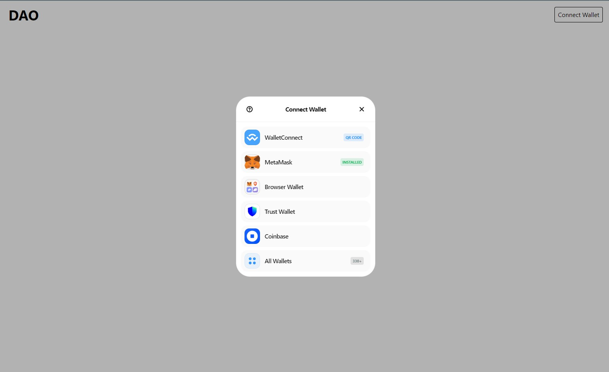
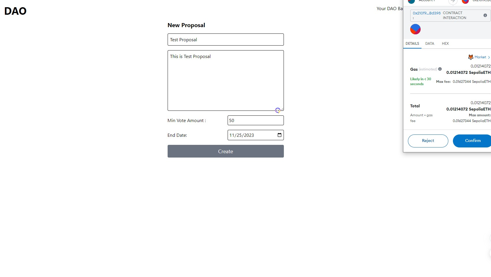
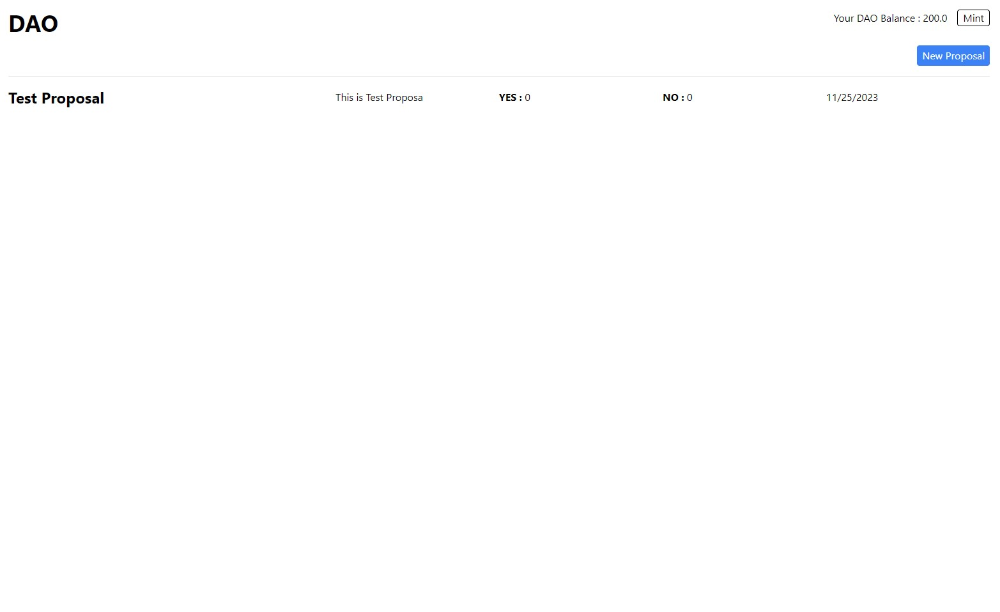
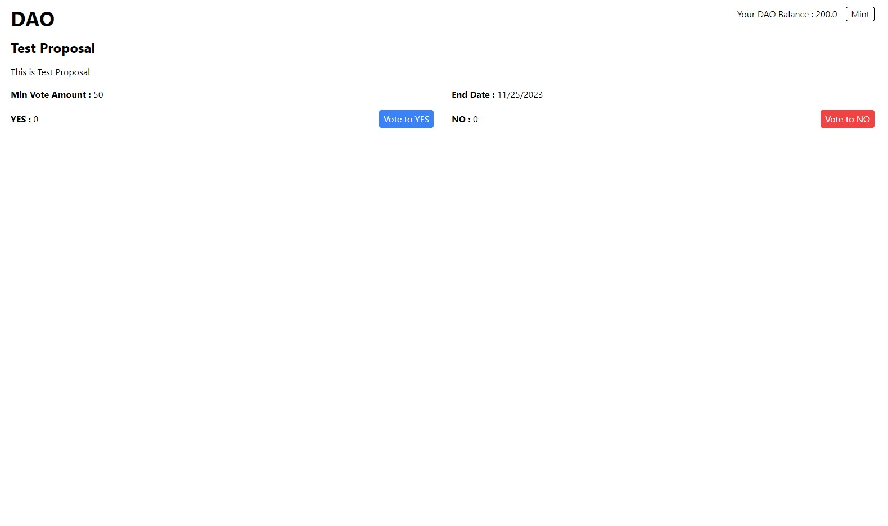

This is a [Next.js](https://nextjs.org/) project bootstrapped with [`create-next-app`](https://github.com/vercel/next.js/tree/canary/packages/create-next-app).

## Getting Started

First, run the development server:

```bash
npm run dev
# or
yarn dev
```

Open [http://localhost:3000](http://localhost:3000) with your browser to see the result.

You can start editing the page by modifying `pages/index.js`. The page auto-updates as you edit the file.

[API routes](https://nextjs.org/docs/api-routes/introduction) can be accessed on [http://localhost:3000/api/hello](http://localhost:3000/api/hello). This endpoint can be edited in `pages/api/hello.js`.

The `pages/api` directory is mapped to `/api/*`. Files in this directory are treated as [API routes](https://nextjs.org/docs/api-routes/introduction) instead of React pages.

## Deployed Contract Addresses

### DAO Token
https://sepolia.etherscan.io/address/0x12538e001818e5471d04373175a260a9f5a1b5a4

### DAO 
https://sepolia.etherscan.io/address/0x210f9e13883c7e3f89f2b15e8b488ec1b0bbd398


## Deployed Address
https://dao-nextjs-tau.vercel.app/

## Screenshots



